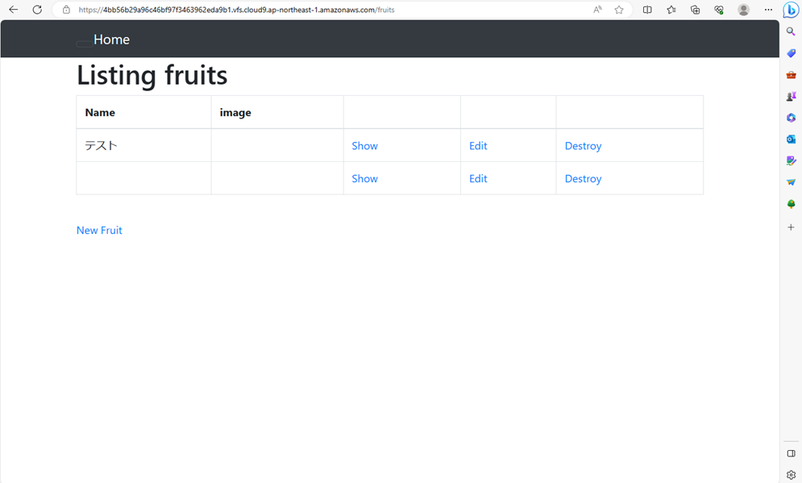
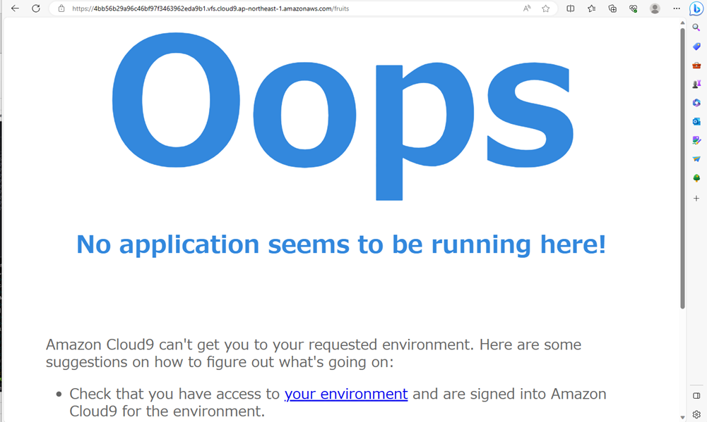

# 第3回課題

## ブラウザでの接続確認完了
正常に接続できた


APサーバを終了させるとアクセス不可となった


## ■Web3層構造
- 利用者の要求をWebサーバが受け取り、APサーバが実際の処理を行い、必要に応じてデータベースサーバに問い合わせ

## ■APサーバ

- アプリケーションプログラムを動作させるサーバ

| APサーバ | ソフトウェア |
| --------- | ----------- |
| Java | Apache Tomcat（オープンソース） | WebLogic Server（オープンソース） |
| Ruby | Puma（オープンソース）、Unicorn（オープンソース） |
| PHP | Apacheに拡張モジュールをインストールすることで動的処理が実行可能 |
| Python | Apacheに拡張モジュールをインストールすることで動的処理が実行可能 |

- 今回の課題で使用したサーバ名とバージョン
　　Puma 5.6.5 (ruby 3.1.2-p20)

- APサーバを終了させたらアクセス不可となり、再起動させるとアクセスできた。
　APサーバは起動していないとページが閲覧できなくなると認識した


## ■DBサーバ

- データを一元管理し、データの検索、更新、保存、バックアップを行うサーバ
- 代表的なDBサーバ
   MySQL,SQLserver,Olacle
- 今回の課題で使用したサーバとバージョン
　　MySQL　8.0.34
- DB サーバーを終了させてもアクセスできた

## ■Rails の構成管理ツール：Bundler

## ■その他備忘録
### サンプルアプリケーションの⼊⼿方法
以下の流れでGitHub上のリモートリポジトリをCloud9上にCloneした
- Cloud9上でSSH認証用の公開鍵を作る
- GitHubにて個人アクセストークンを発行する
- GitHubからリポジトリをCloneする

### DBサーバー起動
```bash
#mysql起動
sudo systemctl start mysqld
```
```bash
#状態表示
systemctl status mysqld
```
